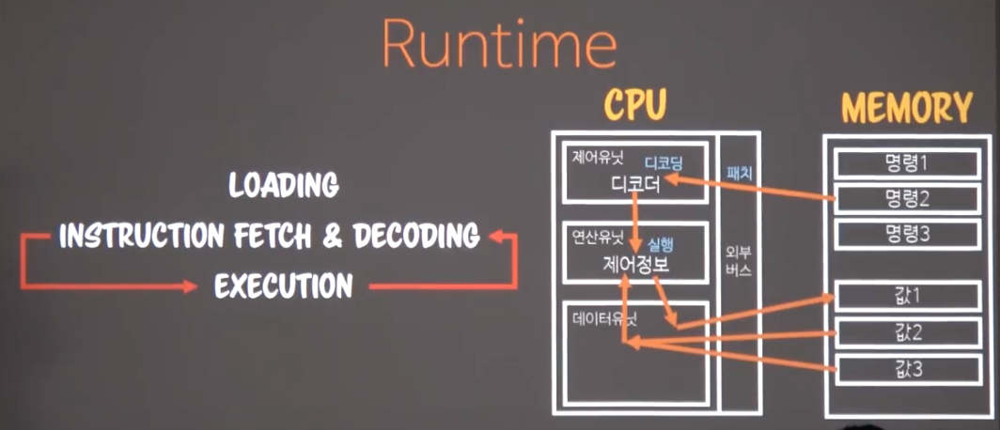

# Object(1)

## Abstraction

### 방법

1. Generalization: 일반화
   1. modeling, funtion, algorithm
2. Association : 연관화
   1. reference, dependence
3. Aggregation : 집단화
   1. grop, category

### 종류

- Data Ab
  - Modeling: 특정 목적에 따라 기억해야만할 것
  - Categorization
    - ex. 아빠, 회사, 사장
  - Grouping: 모아두는 것

- Procedural Ab(대명사)
  > procedure: 데이터의 처리방법을 함수에게 위임한 것! 순차적으로 일어나는 게 아니다. 그냥 함수라고 생각하면 된다.

  - Generalization
  - Capsulization

- OOP Ab(UML)
  - Generalization
  - Realization
  - Dependency
  - Association
  - Directed association
  - Aggregation
  - Component

## Program & Timing

Language Code ---> Lint Time
Machine Language ----> complie Time
File
Load
Run         ----> Run Time(context error, runtime error)
Terminate

## Runtime

```txt
            Loading

|-- instruct fetch & decoding<--|
|                               |
|------------> excution --------|

```



memory에 명령set과 값set 이 적재되고

cpu(제어:디코더, 연산, 데이터유닛)에 제어유닛을 통해 디코딩(cpu가 이해하는 명령으로 바꿈)을 하고 연산 유닛에서 실행, 데이터유닛이 값을 가져음.

그리고 나서 데이터 유닛이 연산유닛에 주고 연산, 그 값을 데이터 유닛이 값을 변경.

- sync(명령이 순차대로 적재), async

### Program Timing & Runtime

1 Essential definition loading
기저에 있는 정의를 먼저 로딩

2 Vtable mapping
A의 가상의 메모리를 진짜 메모리로 변경

< 3,4 반복 >
3 Run
4 Runtime Definition Loading

java는 runtime loaing 을 업계 최초로 적용
팔요한 클래스를 필요할때 최초로 파일에서 로딩

3 Run

Runtime 정의는 확정적인게 아니다. 상대적이다.

## OOP base system

객체지향이 학문적으로 성립하려면 시스템이 무엇을 지원해 줘야 하는가?

### Value & Identifier

값은 값으로 식별하고, 객체는 `메모리의 주소로 식별한다.`

### Polymorphism(고유명사, 두개 원리가 무조건 성립 해야 함)

1. Substitution : 대체가능성
2. Internal identity: 내적동질성

```java
public class Worker extends Runnable{
    @override
    public void run(){
        print("working")
    }
}

public class HardWorker extends Worker{
    @override
    public void run(){
        print("hard working")
    }
}

Runnable worker = Worker()
print(worker.run()) // 동적 바인딩

Worker worker2 = HardWorker()
print(worker2.run()) // 어떤걸로 동작해?
/**
형은 worker로 본다 하더라도 최초에 생성한 객체의 형을 함수 포인터 전원을 유지하겠다.

본직적을 형을 바라본다는게 `내적동질성(Internal identity)`이다.
*/
```

### Object

1. 기능의 캡슐화(`격리를 위해, 수정에 여파가 없도록`)
2. 상태의 모든거에 대한 관리(은닉,...)
