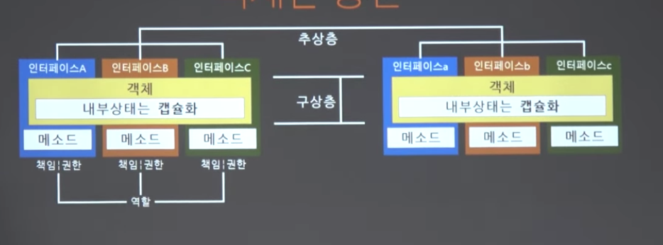
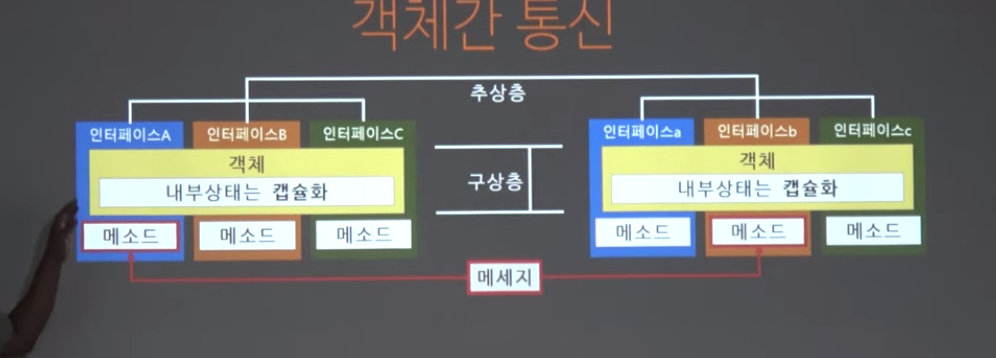
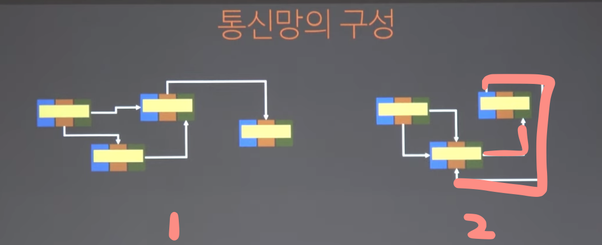
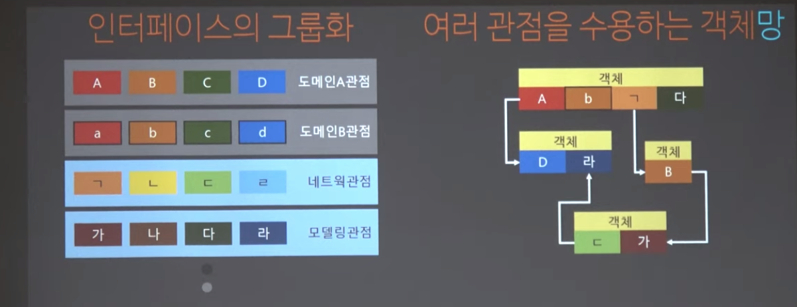
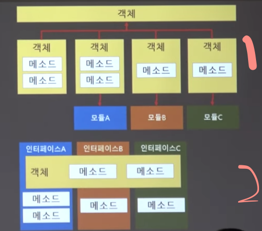
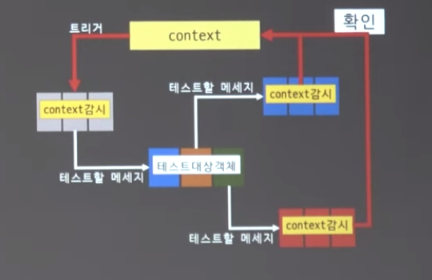

# Object(3) & 객체망과 객체간 통신

> - 객체간의 책임을 주고받기 위해 메세지를 사용
> - 설계란, 구동하는 코드를 배치하는 기술

## 객체간 통신

- 역할 책임 모델
  - 객체지향기반으로 `구동하는 코드를 배치`하는 기술

### 객체망

- 객체
  - 내부상태는 캠슐화
  - 외부 소통은 메소드(정보 은닉)
    - public interface (message)

- 현실 세계의 객체는 역할과 책임은 틀리다.
  - 역할은 객체가 당면한 측면(interface)
  - 책임은 수행할 일 (working function)

> 객체간 통신이란건 `역할의 형태`에 따라 통신하기때문에 형을 보고 통신하지 않는다.

- 일반적으로 (2번)순환망이 생성되면 그 망은 잘못된 것이다.
  --> 설계의 원칙을 지켜 이런 구조가 안생기게 해야 한다.
- 1번 2번을 보면 단일 통신이다.
  - 2번 처럼 양방향 참조를 만들지 말아야 한다.
  - 의존성을 단방향으로 만들어야 한다.

## 객체 설계의 난점

### 인터페이스의 그룹화

> - 수 많은 관점(도메인, 네트워크, 모델링)에 따라 인터페이스는 달라질 수 있다.
> - 관점마다 수만은 책임이 도출된다.

### 알려진 기본 설계요령(SOLID원칙)

1. SRP(Single Responsibility,단일책임)

- 책임:변화의 이유, 수정의 이유
  - 변화의 이유(변화율)를 하나로 만들어라
  - 쓸대없는 책임을 벗어나야 한다.
  - ex. Spring AOP에서 주로 다룸
- Shotgun surgery
  - 하나의 변화때문에 여러 코트를 고쳐야 하는 현상

2. OCP(Open Closed 개방폐쇠)

> - Open(확장에 열려있고)
> - Closed(수정에 닫혀있다)
> - B의 수정이 A에 영향을 안줌

- 직접 참조하지 않는다.(B가 A를 직접 참조하지 않는다)
  - 추상형, 어뎁터, 미디에이터(Mediator 패턴), 메이저를 가지고 참조한다.
  - B는 확장에 자유롭고, A는 영향을 받지 않는다.
- `구현보다는 interface를 참조하라`

3. LSP(Liskov Substitusion, 업캐스팅 안전)  

> - 부모클래스 자리에는 자식형을 넣을 수 있다.
> - 추상층의 정의가 너무 구체적이면 구상층 구현에서 모순이 발생함.

- 추상층: 생물(숨을 쉰다 O,다리로 이동한다 X)
  - 구상층:
    - 사람 O, 타조 O, 아메바 X, 독수리 X, 고래 X
- 이럴 경우 다른 형태로 변경
  - 추상층: 생물(숨을 쉰다),다리로 이동
  - 구상층:
    - 사람:생물, 다리로 이동
    - 타조: 생물, 다리로 이동
    - 아메바:생물
    - ...
- `만약, 문제점이 발견 된다면 추상층을 빨리 변경해라!`

4. ISP(Interface Segregation, 인터페이스 분리)

5. DIP(Dependency Inversion, 다운캐스팅 금지)

> 추상화 된것은 구체적인 것에 의존하면 안된다. `구체적인 것이 추상화된 것에 의존해야 한다.`

### 추가적으로

- DI(Dependency Injection, 의존성 주입)
  - (IoC Inversion of Control, 제어역전)

- DRY(Don't Repeap Yourself, 중복방지)
  - 같은 일을 하는 코드는 하나만!

- Hollywood Prnciple(의존성 부패방지)
  - `묻지말고 시켜라`
    - 물으면(질문용 객체 전달) 많은 것을 알게해야하니 그냥 시켜라
      - 물어보면 대답용 객체가 온다.
      - 객체의존성 추가
    - 물어보고 대답이 오는지도 모른다.

- Law of demeter(최소 지식)
  - 1차 관계 메소드만 의존성을 가져야 함.
  - classA.methodA의 최대 지식의 한계:
    - classA의 필드 객체
    - methodA가 생성한 객체
    - methodA의 인자로 넘어온 객체
  - 추가로 간접 객체(2차 메소드)를 의존하지 말아라.
    - 안된다면, 1차 관계 메소드가 Wrapping메소드를 제공해야 한다.

### 의존성 부패방지(Hollywood Prnciple)와 최소지식(Law of demeter)의 모순

> 두 원칙을 지키면 해당 `객체와 메세지를 주고 받는 것은 가능`하나 내부를 들어다 볼 방법이 없음
> `하지만, 이러면 객체가 잘 동작했는지를 모른다. 확인 가능한 수단을 가져야 한다.`

- 결국 객체가 제대로 작동하는가를 테스트하려면:
  1. 객체를 통신망에서 테스트할 객체에게 메세지를 보낸뒤
  2. 그 객체가 이웃 객체에게 메세지를 잘 보냈는지 확인
  3. 3번을 위해 통신한 이웃 객체를 조사하면 된다.

#### Mock 객체를 활용한 검증(객체망 검증)

> - 해당 객체를 추월해서 볼수 없으므로(Runtime시점에 객체 생성&동작), 객체망의 통신을 검증하기 위해 사용
> - mockery(모조객체, 테스트 관리 객체)와 mock(목객체, 테스트용 모의 객체)
> - mockery = 모조객체 = context

1. 필요한 목객체를 생성하고
2. 테스트할 객체를 둘러싼 객체망을 구성한 뒤(DI)
3. 트리거가 되는 메세지를 일으켜
4. 각 목객체의 상태를 확인하다.

- `객체 지향 원리를 제대로 적용했다면 객체 안을 바라볼 수 없고,객체는 책임으로 동작`하며, 책임은 메세지를 주고 받는 행위이다. 그리서 Mock 시스템으로 테스팅한다.

## GRASP(Pattern)

1. 정보 담당자, Information Expert
2. 소유권한, Creator
3. 컨트롤러, Controller
4. 낮은 연결, Low Coupling
5. 높은 응집도, High Cohesion
6. 간접 참조, Indirection
7. 다형성, Polymorphism
8. 순수 조립, pure Fabrication
9. 변화 보호, Protected Variations