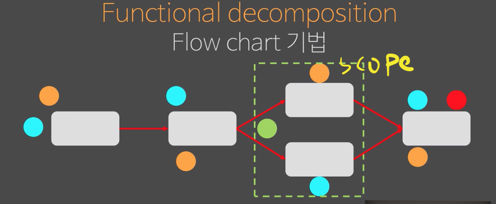
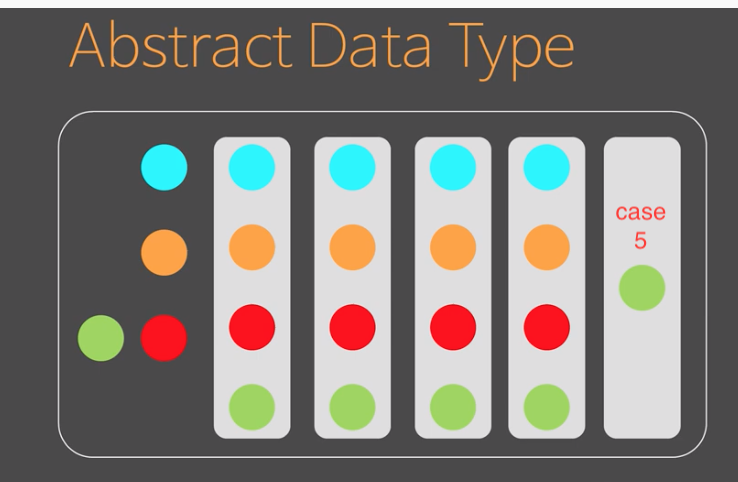

# Object(5) & 분해(decomposition)

composition: 하나 하나 가치가 있음
assemble: 조립을 통해 가치가 생성

도메인을 분해해 composition을 만들고 싶다라는게 이 챕터의 핵심이다.

분해를 안하면? 복잡성 폭팔하기 때문에 필요하다.

## Functional decomposition(함수로의 분해)

### Flow chart 기볍

사람의 뇌가 flow 처리를 선호하기 때문에(todo,...) 보통 사용

내가 모르는 경우의 수가 나올 경우 그나마 해결방법은 scope 밖에 없다.
모든 경우의 수를 내다볼 수 없다면 하지 말아라.

도메인을 10년간 한결같은 솔루션이라면 이런 기법을 사용할 확률이 높다.

### Abstract Data Type

> Data를 기준으로 세상을 바라봄.

data의 변화가 없고, 기능만 주로 추가된다면 이것도 괜찮다.
하지만, 다른 data(상태)가 계속 추가 된다면?
모든 코드에 케이스를 추가해야한다.

5번 케이스는, 초록색일때 초록색을 주고 아니면 결과를 못내준다.
이질적인 케이스가 추가되는 것이다.

1. 상태가 확정되고,
2. 모든 메소드가 가용한 상태를 전체를 커퍼하는 메소드들로만 구성해야 한다.

이 2개가 만족하지 않으면 ADT는 실패 했다.
내가 짠 코드가 이렇게 생길 확률이 높다. 이걸 객체지향과 해깔리는 것이다.
case 5번은 결국 레거시 코드가 된다.

### Object Oriented

> 연산을 먼저 추상화 한 다음에 연산을 상속받는 무언가를 만든다.
> 상태에 따라 상속구조를 바꿔 형을 늘려가는 구조인다.

`<b> 데이타를 기준으로 형을 확장함.</b>`

ADT를 이용하면 형이 줄어든다. 하지만, OOP에서는 상태에 따라 형이 더 만들어 진다. 보는 관점이 완전 다르다.

Lasy binding을 통해 형을 늘려가는 구조인다. 생태보다 형이 많아지는 건 당연하다. OOP장점은 상태 추가시 여파를 끼치지 않고 상태가 추가된다.

ex. 2단 if 제거 --> 전략 객체가 2개

## 개발자의 세계 ADT

